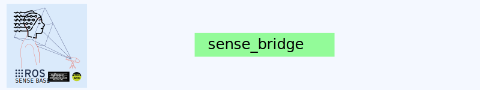

<div style="text-align: center;" align="center">
  
  <h1> sense_bridge </h1>
</div>

## :eyeglasses: Overview

`sense_bridge` is a ROS 2 (Humble) package that provides utility functions to convert between NumPy arrays and custom `EEGBlock` messages defined in [`sense_msgs`](https://github.com/your-org/sense_msgs). It enables the structured EEG data collected to be flattened and transmitted as ROS messages.

## Features

- Convert EEG data from NumPy arrays to `EEGBlock` messages and vice versa.
- Ensures compatibility with the `sense_eeg` publisher and downstream ROS 2 nodes.

## How to Use

Clone the `sense-base/base` and create the directory `workspace/src`. Clone `sense_bridge` package into the `workspace/src`:


```bash
mkdir sense-base && cd sense-base
git clone git@github.com:sense-base/base.git
cd base
mkdir workspace/src
# Clone this sense_bridge repo
git clone git@github.com:sense-base/sense_bridge.git
# Clone the sense_msgs package
git clone git@github.com:sense-base/sense_msgs.git
```

Open the sense-base/base folder in VS Code and Reopen in Container when prompted. In the `.devcontainer`, build the workspace:

```bash
colcon build --packages-select eeg_msgs eeg_bridge
source install/setup.bash
```
Once sourced, you can use the bridge in Python (or in other related packages):

```bash
python 3
```

```python
from eeg_bridge.bridge import EEGBridge
```

To run the test locally:

```bash
cd sense-base/base/workspace/src/sense_bridge
uv pip install ."[dev]"
uv run pytest eeg_bridge/test
```
